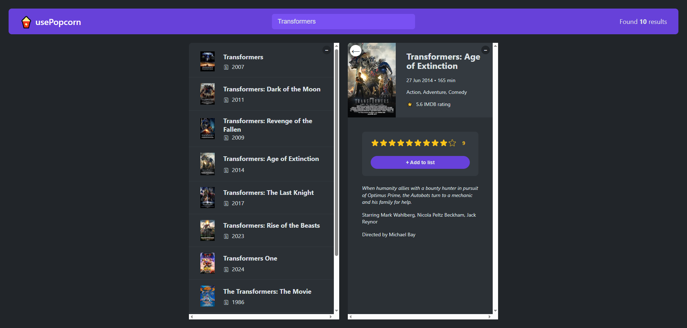

# 🍿 usePopcorn

A React movie-search and rating application built with React. Search for movies, view detailed information, rate movies, and maintain a personal watched-movie list.

## 🚀 Live Demo

👉 [Live Demo](https://usepopcorn-reactjs-w-j.netlify.app/)

---

## 📸 Preview



---

## ✨ Features

- 🔎 Search movies using the OMDb API
- 🎬 View movie posters, titles, and release years
- 📖 View detailed movie information
  - Release date
  - Runtime
  - Genre
  - IMDb rating
  - Plot
  - Actors
  - Director
- ⭐ Rate movies from 1–10
- ➕ Add rated movies to a watched list
- 🗑️ Remove movies from the watched list
- 📊 View watched-movie statistics
  - Number of movies watched
  - Average IMDb rating
  - Average user rating
  - Average runtime
- ⌨️ Close movie details with the `Escape` key
- ⏳ Loading and error states
- 🛑 Cancel outdated search requests with `AbortController`

## 🛠️ Technologies

- React
- JavaScript (ES6+)
- React Hooks (`useState`, `useEffect`)
- Fetch API
- OMDb API
- CSS
- Custom `StarRating` component

## 🧩 Main Components

| Component           | Purpose                                                 |
| ------------------- | ------------------------------------------------------- |
| `App`               | Main application state and logic                        |
| `Navbar`            | Application navigation/header                           |
| `Logo`              | Displays the usePopcorn branding                        |
| `Search`            | Handles movie searches                                  |
| `NumResults`        | Displays the number of search results                   |
| `MovieList`         | Renders the search results                              |
| `Movie`             | Displays an individual movie                            |
| `MovieDetails`      | Displays detailed movie information and rating controls |
| `WatchedSummary`    | Displays watched-movie statistics                       |
| `WatchedMoviesList` | Renders watched movies                                  |
| `WatchedMovie`      | Displays an individual watched movie                    |
| `Box`               | Provides a collapsible content area                     |
| `Loader`            | Displays the loading state                              |
| `ErrorMessage`      | Displays errors                                         |

## 🔄 How It Works

### 1. Search for a movie

The search query is stored in React state. Once the query contains at least **3 characters**, the application sends a request to the OMDb API.

```text
User types movie name
        ↓
Search state updates
        ↓
useEffect runs
        ↓
OMDb API request
        ↓
Movie results displayed
```

### 2. Select a movie

Clicking a movie stores its IMDb ID in `selectedId`. The `MovieDetails` component then fetches additional information for that movie.

### 3. Rate and watch

Users can give a movie a rating from **1 to 10**. After selecting a rating, the movie can be added to the watched list.

### 4. Watched statistics

The application calculates:

- Total watched movies
- Average IMDb rating
- Average user rating
- Average movie runtime

## 🌐 OMDb API

This project uses the **OMDb API** for movie search and movie details.

The application performs requests similar to:

```text
https://www.omdbapi.com/?apikey=YOUR_API_KEY&s=movie
https://www.omdbapi.com/?apikey=YOUR_API_KEY&i=imdb_id
```

> **Security:** Do not commit your real API key to a public GitHub repository. Store it in an environment variable instead.

## 🚀 Getting Started

### Prerequisites

Make sure you have:

- Node.js installed
- npm installed
- An OMDb API key

### Installation

Clone the repository:

```bash
git clone YOUR_REPOSITORY_URL
```

Go into the project directory:

```bash
cd YOUR_PROJECT_DIRECTORY
```

Install dependencies:

```bash
npm install
```

Configure your OMDb API key according to your React project's environment-variable setup.

Start the development server:

```bash
npm start
```

Then open the local development URL shown by your terminal.

## 📁 Project Structure

A typical structure for this project is:

```text
src/
├── App.js
├── StarRating.js
├── index.js
├── index.css
└── ...
```

## 💡 React Concepts Practiced

This project demonstrates several important React concepts:

- `useState`
- `useEffect`
- Component composition
- Props
- State lifting
- Controlled inputs
- Conditional rendering
- Event handling
- Effect cleanup
- API requests
- `AbortController`
- Array methods such as `map`, `filter`, `find`, and `reduce`

## 🔮 Possible Improvements

- Persist the watched list using `localStorage`
- Move the API key to environment variables
- Add better error handling for movie-detail requests
- Add pagination or infinite scrolling
- Add search debouncing
- Improve accessibility
- Add automated tests
- Add responsive design improvements

## 📌 Note

The watched list currently exists in React state, so the provided implementation does not persist watched movies after a full page refresh.

---

Made with ❤️ using React and the OMDb API.

## 👨‍💻 Author

**Md Rana**  
Frontend Engineer (JavaScript / Reactjs / Next.js)

- 🔗 LinkedIn: [Connect with me](https://www.linkedin.com/in/iamtheasad/)

---

⭐ If you like this project, don't forget to give it a star!
